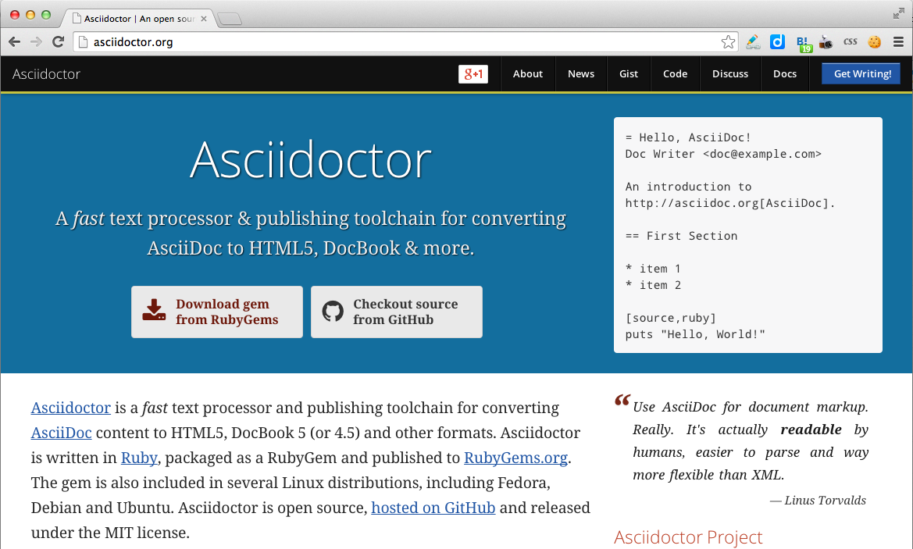
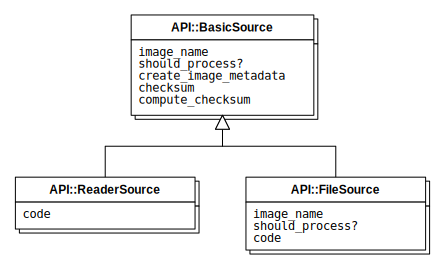

== 画像埋め込みのサンプル

:cacoo_does_download_contents: true
:cacoo_contents_xml_indent: 0

=== 画像ファイルの埋め込み

`image::ファイル名[]`と書けば画像を埋め込めます。以下に例を示します。

=== Cacooで作成した図をPNGで埋め込み

まずCacooのdiagramIdを知る必要があります。例えば図を表示するURLが https://cacoo.com/diagrams/f0MLos8tgXXxaTBv であれば、diagramIdはf0MLos8tgXXxaTBvとなります。

あとはAsciiDoc文書内で以下のように書けば、図を埋め込むことが出来ます。

----
cacoo::f0MLos8tgXXxaTBv["png", alt="DiagramBlockProcessor class"]
----

以下に例を示します。

cacoo::f0MLos8tgXXxaTBv["png", alt="DiagramBlockProcessor class"]

==== Cacooの図の内容をXMLで取得してSubversionで変更内容を管理

PNG画像を取得するだけだと、図を編集した変更内容が把握できません。そこで、AsciiDoc文書の先頭に以下の様な設定を追加しておいてください。

----
:cacoo_does_download_contents: true
:cacoo_contents_xml_indent: 0
----

こうしておくと、`cacoo-図ID-contents.xml` というファイルも生成されるようになりますので、これもSubversionにコミットするようにしてください。

=== Cacooで作成した図をSVGで埋め込み

==== Cacooの図をSVGでエクスポート

Cacooで図を開いて `[エクスポート]/[SVGでエクスポート]` メニューで図をSVG形式で保存します。

==== SVGを編集してwidthとheigth属性を追加

保存したSVGファイルをテキストエディタで編集し、ルートの `svg` タグにwidthとheight属性を設定します。
viewBox属性がついていますので、その幅と高さに合わせます。

例えばルートの `svg` タグが以下の様な場合

----
<svg contentScriptType="text/ecmascript" xmlns:xlink="http://www.w3.org/1999/xlink" zoomAndPan="magnify" contentStyleType="text/css" viewBox="75.0 34.5 441.0 265.5" xmlns:cacoo="http://cacoo.com/" preserveAspectRatio="xMidYMin meet" xmlns="http://www.w3.org/2000/svg" version="1.1">
----

`viewBox="75.0 34.5 441.0 265.5"` となっていますので `width="441.0" height="265.5"` を追加します。

----
<svg contentScriptType="text/ecmascript" xmlns:xlink="http://www.w3.org/1999/xlink" zoomAndPan="magnify" contentStyleType="text/css" width="441.0" height="265.5" viewBox="75.0 34.5 441.0 265.5" xmlns:cacoo="http://cacoo.com/" preserveAspectRatio="xMidYMin meet" xmlns="http://www.w3.org/2000/svg" version="1.1">
----

==== SVGをAsciiDoc文書に埋め込み

あとは通常の画像の埋め込みと同じで `image::ファイル名[]`と書けば画像を埋め込めます。以下に例を示します。

SVGを埋め込むのは手順が面倒ではあるのですが、PNGを埋め込む場合とくらべて図の中の文字が読みやすいので、できればこちらの方式にしてください。
